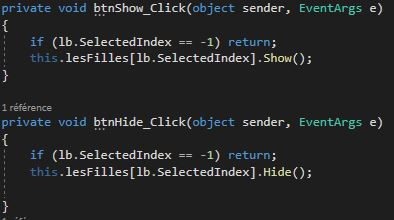
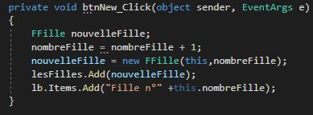

# windows_form

## OUTILS:

- Visual Studio
- C#
- Windows Form
- Git

## TP: Fenêtre Mère/Fille

L'objectif de ce projet est de gérer deux fenêtres communiquantes entre elles dans une même application. Au départ, on créee la fenêtre par défaut (Mère) dans laquelle nous avons mis en oeuvre plusieurs fonctionnalités.

Description des boutons:

- NEWS: Instancie une nouvelle fille dans la ListBox

- CLOSE: Ferme la fenêtre séléctionnée

- SHOW: Affiche la fenêtre Fille selectionnée

- SHOWDIALOG: Permet aussi, d'ouvrir la fenêtre Fille selectionnée

- HIDE: Fait disparaitre la fenêtre Fille de la ListBox

Ensuite, une deuxième fenêtre (Fille) permet à l'utilisateur d'entrer un nouveau nom.

Code fenetre mere             |  Code boite de dialogue 
:-------------------------:|:-------------------------:
|         | 
